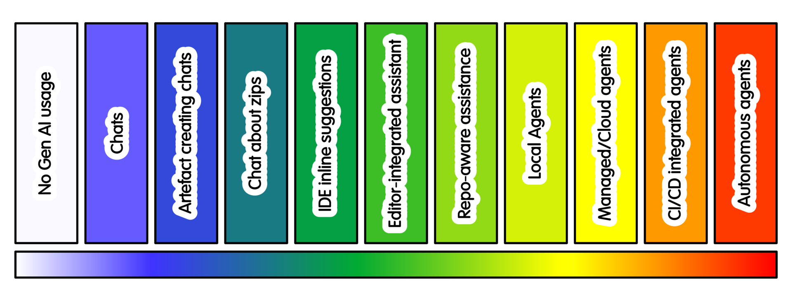

## Cross Cutting Practices

### You promote the work, the AI does not

A useful default is:

* AI prepares candidate work
* a person reviews it
* a person pulls, commits, merges, publishes or deploys it

A generated branch, patch or pull request is not an accepted contribution.
It is a candidate contribution.

This matters because AI tools can create plausible work quickly.
The question is not just whether the work exists.
The question is whether a person understands it, accepts it, and can explain why it is correct.

For individual work, this may mean copying the change into your own checkout, committing it yourself, and recording why you accepted it.

For a shared project, this may mean a maintainer reviews, adapts and merges it through the normal contribution process.

For research outputs, this may mean the researcher responsible for the result can explain how the generated artefact was checked.

### Use a separate AI working copy

Where practical, give AI tooling its own local checkout.
Treat that checkout as owned by the tool, not as your main working copy.

The aim is to let the AI prepare changes without giving it authority to change shared project state.

A useful pattern is:

* create a separate local checkout for the AI tool
* remove or disable remote push access from that checkout
* keep your own normal checkout separate
* add the AI checkout as a local remote, or copy patches across manually
* inspect and pull individual changes into your own checkout
* commit and push only changes you understand and approve

Removing a Git remote is a useful guardrail. It is not a complete security control.

Do not give the tool credentials, tokens, or access it does not need.

This is especially useful where the AI tool can run Git commands, stage files,
commit changes, create branches, or interact with repository tooling.

The point is not that this makes AI output safe.
The point is that it gives the people working with AI a clear review boundary.

### Treat remote execution as a governance boundary

When an AI tool runs outside your local machine, the risk changes.

A managed or cloud agent may receive repository access, logs, configuration, test output, project structure, private package names or other context.

Before connecting a remote service, decide:

* What code, code and logs it may see
* What repositories it may access
* What permissions it receives
* Whether it can create branches or pull requests
* Whether it can use paid or shared compute resources

Remote execution may be useful. It can reduce setup difficulties and run checks in a clean environment.
It should **not** be treated as merely a more convenient local editor - due to greater risks.

### Protect maintainer attention

Maintainer attention is an irreplaceable limited resource.

AI-generated activity can look useful while consuming review capacity.
This includes duplicate issues, noisy comments, plausible but low-value pull requests, dependency updates, broad refactors, and repeated suggestions.

For research software, this matters because important project knowledge is often held in discussion:
scientific assumptions, validation choices, roadmap decisions, domain constraints and user needs.

If automation overwhelms or hides those conversations, it is damaging the project.

Useful controls include:

* rate limits
* clear labels
* AI staging repositories
* Agent only staging areas
* maintainer opt-in review
* no expectation that every AI-generated suggestion will be reviewed

The aim is to stop machine-generated volume from becoming a second inbox with unmanageable priority.

### Review actions as well as outputs

Once AI tools can act, review is not only about code.

You may need to check what the tool did:

* Files read or changed
* Commands and tests that were ran
* Data and services accessed and contacted
* What branches, commits or pull requests it created
* Assumptions underlying these actions and changes
* Last, but not least - what it did not verify

This becomes more important as tools gain access to repositories, terminals, CI systems, issue trackers, cloud resources or external APIs.

The risks include unsafe action and bad code.

### Do not treat prompts as controls

Natural language instructions are useful.
They are suggestions (guidance), rather than controls.

You need to treat AI as untrusted rather than potentially untrustworthy. Currently and for the foreseeable future the probablistic nature of GenAI based systems requires this stance. While such systems are generally good at following instructions, they will occasionally ignore such guidance.

Natural language guidance should be backed up by actual guardrails. For example:

* "Do not push" needs backing up with "this checkout cannot push".
* "Ask before deleting" is weaker than "this account cannot delete".
* "Do not access production data" is weaker than "production data is unavailable".

Where the consequence matters, structural controls follow standard best practices for untrusted domains.

* least privilege
* read-only access
* restricted tokens
* protected branches
* no production credentials
* no unnecessary secrets
* allowlists
* audit logs
* Approval gates managed by designated people
* immutable backups
* time and cost limits

The safe behaviour should not depend only on the model choosing correctly.

### Keep the intensity justified

Higher-intensity AI use should solve a real problem.

It may be justified when it reduces setup difficulties, improves reviewable output,
runs checks in a reproducible environment, or helps explore several candidate approaches.

It is not justified simply because the tool offers the feature.

Periodically ask:

* Is this still helping?
* Is the review burden reasonable?
* Is the project easier to understand?
* Are maintainers being helped or overloaded?
* Are people still making the important decisions?
* Would a lower-intensity practice be enough?

Often the right response is not a better prompt.
It is less authority, less context, fewer tools, or no AI for that task.
