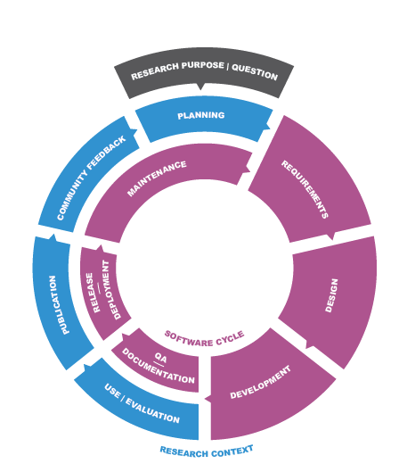

The research software lifecycle provides a model for understanding the different phases
encountered during the development of research software.

The research software lifecycle description used here was originally developed by the [Infrastructures for Quality Research Software](https://eosc.eu/advisory-groups/infrastructures-quality-research-software/)
EOSC Task Force. This Task Force tried to achieve a common understanding on the processes in research software engineering to asses the research infrastructure needs.
For this reason, the Task Force split into various subgroups investigating different aspects of the research software engineering process.
SubGroup 1 of the Task Force took a closer look at the research software lifecycle, and reported its findings in the deliverable [Research Software Lifecycle](https://doi.org/10.5281/zenodo.8324828).
The aim of this document was to illustrate the lifecycle of research software and how its instantiations for particular software projects are influenced by varying developer groups and their intentions.

## Lifecycle Stages

The [Research Software Lifecycle report](https://doi.org/10.5281/zenodo.8324828) nicely summarises the stages in the diagram - the software lifecycle within the wider research context (cycle).
Below we cite heavily from this report, adding details where necessary, and provide links to relevant task pages.

It helps to consider the lifecycle of your research software project through the lens of a software management plan (SMP).
A software management plan is a document that describes how the software will be developed, maintained, published, archived, etcetera.
There are several guides available for writing a software management plan, such as the [Practical guide to Software Management Plans](https://zenodo.org/records/7589725).

### Planning
🔍

> A research question, a new service or feature request (e.g. data service, workflow automation) or tenders from funders (e.g. from EU) initiate the planning phase.
>
> Planning research software development usually happens in the context of a student thesis (BSc, MSc, PhD), or for a larger research project including preparations of concrete scientific articles.
> Also new releases for longer running research software projects often trigger a "start over".
>
> The planning stage can be facilitated by or include a requirements analysis (for all levels), a value proposition (for software products) or a market or community survey in order to understand the audience (for software products or platforms).
> Also a roadmap for the initial development and later stages can be instrumental.

### Requirements
🔧 + 🔍

When the high-level research/organizational planning has been done, the software implementation phase starts.
The first stage is to gather and/or analyse software requirements.
This can be done in a more formal way, e.g. by using user stories, or in a more informal way, e.g. by discussing the requirements with the team members.
This stage is usually done in close collaboration with the research team, to make sure the research question is well understood and the requirements are aligned with it.
It may include the following activities:
- **Requirements analysis**: Identify the functional and non-functional requirements of the software.
- **User stories**: Create user stories to capture the requirements from the user's perspective.
- **Use cases**: Define use cases to describe how the software will be used in practice.

### Design
🔧 + 🔍

Once the requirements are clear, the next stage is to design the software.
This stage can include the following activities:
- **Architecture design**: Define the overall architecture of the software, including the components and their interactions.
- **User interface design**: Design the user interface of the software, including the layout, navigation, and interaction patterns.
- **Data model design**: Define the data model of the software, including the data structures and their relationships.

### Development
🔧 + 🔍

This is the stage where the actual software development takes place.
It can include the following activities:
- **Implementation**: Write the code for the software, following the design and requirements.
- **Code review**: Review the code to ensure it meets the quality standards and follows the design.

Development can be done in an iterative way, where the software is developed in small increments, and each increment is tested and reviewed before moving on to the next one.
Another approach is to use a more traditional waterfall model, where the software is developed in a linear way, with each stage completed before moving on to the next one.
> In single-person projects such as student theses, implementation is naturally performed in a more sequential manner.

### QA & Documentation
🔧

Some crucial aspects of the software development process are often overlooked, such as quality assurance (QA) and documentation.
QA is the process of ensuring that the software meets the quality standards and requirements, including testing, code reviews, quality checks, and performance measurements.
Preferably, such QA processes are automated through continuous integration.
Documentation is the process of creating and maintaining the documentation for the software, including user manuals, API documentation, and developer guides.
QA and documentation can be done in parallel with the development stage, or as a separate stage after the development is completed.

### Deployment
🔧

> Software is not only provided as source code and executable, but also via direct use in platforms.
> This targets software as a service that adds some specific issues compared to an on-premise software publisher, e.g. interfaces to authentication and authorization, data, monitoring, scalability, accounting, continuous maintenance.
> Such integration can be started by the software developer by providing software and data within Jupyter notebooks, containers or virtual machines as a first or intermediate step towards a software as a service.
> Here, the deployment and integration process of the specific software is meant, the platform itself is a necessary ingredient but often not in the focus of the software development lifecycle.
> Both - the integration and the platforms - are a necessary ingredient to the EOSC integration.
> Open source publication should be preferred before integration to a platform but other options are also possible, keeping in mind that for software as a service a valid business model may be needed (e.g. there are models of having a community edition for free and a professional edition with a support fee).

### Maintenance
🔧

> The maintenance stage is typically the longest stage in the software lifecycle, although it can also be the shortest one if the software is not used or not maintained, which is often the case for research software (especially tier 1 software).
> It includes the following activities:
- **Bug fixing**: Identify and fix bugs in the software.
- **Feature development**: Add new features to the software based on user feedback and requirements.
- **Refactoring**: Improve the code quality and maintainability of the software.
> - **Performance optimization**: Improve the performance of the software by optimizing the code and algorithms.
> - **Security updates**: Apply security patches and updates to the software to ensure its security and stability.
> - **Documentation updates**: Update the documentation to reflect the changes in the software.
> - **User support**: Provide support to users of the software, including answering questions, resolving issues, and providing training.
> - **Versioning**: Manage the versions of the software, including tagging releases, maintaining a changelog, and managing dependencies.

Issue tracking via a platform like GitHub can facilitate the collection of user feedback and bug reports.

### Publication
🔍

> While software is worth being published per se, currently in research, the publication of research software usually accompanies the completion and publication of a document such as a student thesis, scientific article or project report.
> Further ingredients such as input and result data, containers, notebooks, or workflow descriptions should ideally yield an integrated research compendium/object.
> Research software should in itself be citable and should be referenced in the document.
> Research software engineers (RSEs) often play an important role in developing the software, without necessarily becoming co-author of the resulting papers or datasets.
> It is therefore important to give them recognition for their contributions through software citation.
> In addition to publishing the software itself, various dedicated journals exist that offer the service of publishing research software papers (e.g. [Journal of Open Source Software](https://joss.theoj.org/), [Journal of Open Research Software](https://openresearchsoftware.metajnl.com/), [SoftwareX](https://www.journals.elsevier.com/softwarex/)).
> 
> The publication/deployment stage of research software can be facilitated by, e.g., (i) CD frameworks, (ii) publication services, (iii) archival services or (iv) training and support services, (v) [research software directories](https://github.com/research-software-directory).
> A link between research software and other research objects can be established within research
software directories, requiring proper IDs, e.g. by minting DOIs via [Zenodo](https://zenodo.org) or the [Software
Heritage](https://www.softwareheritage.org/) IDs.
>
> At the latest during the publication preparation - but preferably at an as early stage as possible - metadata should be added to the software.
> Several standards are in use and under
harmonization via several EOSC-related groups (like the [ EOSC Task Force FAIR Metrics and Data Quality](https://www.eosc.eu/sites/default/files/tfcharters/eosca_tffairmetricsanddataquality_draftcharter_20210
614.pdf) and the [EOSC Task Force Semantic Interoperability](https://www.eosc.eu/sites/default/files/tfcharters/eosca_tfsemanticinteroperability_draftcharter_202106
14.pdf)).
> Currently used standards are the [Citation File Format](https://citation-file-format.github.io/) and [CodeMeta](https://codemeta.github.io/).
> The findability can be increased by adding a citation to software and referencing in accompanying articles.

### Evaluation & Community Feedback
🔍

> The form, amount and timeliness of community feedback to research software can vary substantially depending on the size, maturity and targeted application range and audience.
> In addition to the dissemination of the scientific articles describing (and advertising) the software, presentations at conferences and other meetings potentially help to initiate and grow a user community.
> 
> The community feedback stage can be facilitated by appropriate communication channels (helpdesk, issue tracker, email lists, chat applications ...) or even an established means to let the community contribute to or assess the quality of the software in general.
> 
> #### Continuation or Termination
> Feedback and reuse can either lead to new research questions initiating another full cycle, trigger smaller implementation cycles in the context of software maintenance or termination of the development/service.
> Particularly in this stage, the user stories can be changed and also the application classes can be newly defined.

## Research Software Lifecycle & Three-Tier Model

There is a close link between this software lifecycle and the [three-tier model of software](/three_tier_view). 
Depending on its tier, the software lifecycle length or the number of iterations through the lifecycle may vary. 

For example, the development of analysis code (tier 1 software) is directly driven
by a research question, and involves little planning and software engineering effort with limited documentation and testing. 
Once the software is finished and the research question answered, it is important to publish the software together with 
the related research outputs, such as papers, datasets, workflows, etc. After this publication, the cycle ends and the software
is not developed further nor maintained.

Prototype tools (tier 2 software) are typically designed to answer multiple research questions (so "Research Question" from the diagram 
becomes "Research Purpose"), and are often developed and used by more than one person. The developers and users of the
software are typically part of the same research team or organisation, although the size and composition of the team may vary over time. 
There is a close connection between the research and software development parts of the cycle. 
Due to the broader scope and longer lifetime of the software, more extensive planning of development is needed to ensure 
the software cycle matches the research cycle. In addition, the application of more advanced software engineering practices 
(e.g., issue tracking, semantic versioning, test coverage, code style and quality checkers, code reviews, etc.) is needed
to enable the software to be efficiently developed by a (potentially changing) team and to allow user feedback to be recorded. 
To ensure reproducibility of results, versioned releases should
be archived, and properly cited in papers. 
After publication, the development cycle continues to answer further research questions and apply improvements and bug fixes to the existing code.

Research software infrastructure (tier 3 software) represents broadly applicable research software. For such software,
the software and research lifecycles are no longer directly connected.
The development team may be large and possibly distributed over multiple organisations.
Different team members may have have different objectives and represent different communities.
There may be a large
group of external users who depend on the software without directly contributing to the development.
Proper development planning and community management should be used to organise the team members,
collect user feedback, and ensure a regular release cycle.
This tier requires the most advanced software engineering techniques to ensure a smooth development process, quality, and long term
maintainability. For online services or mission critical software that require continuous operation, special software engineering methods such as DevOps and CI/CD are needed. 
To ensure the long term sustainability of the software, governance model and funding or business model are required.
