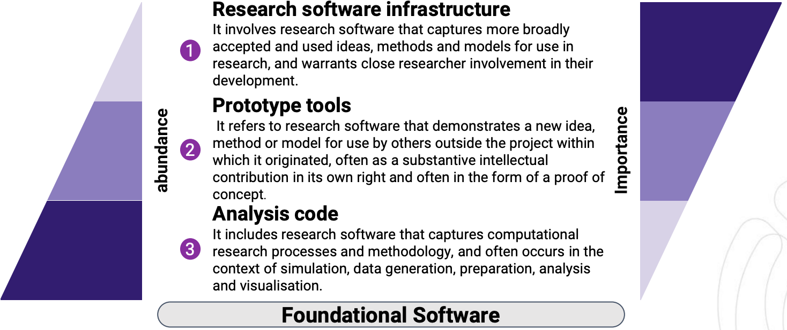

## Three-Tier Model of Research Software

The three-tier model of research software provides a framework for understanding the diverse landscape of software in research. This model distinguishes three tiers of research software, each spanning the entire software development journey:

*Diagram from ["EVERSE Paving the way towards a European Virtual Institute for Research Software Excellence" presentation](https://indico.cern.ch/event/1501988/contributions/6323204/attachments/3016679/5320601/EVERSE_Overview_Slides.pdf) by F. Psomopoulos, February 2025*

Analysis code: This includes research software that captures computational research processes and methodology, often used in simulation, data generation, preparation, analysis and visualisation. It typically represents software created for personal use with a small scope, such as analysis scripts. For example, [Nipype](https://nipype.readthedocs.io/en/latest/), a Python-based framework for neuroimaging data processing, began as a collection of analysis scripts before evolving into a more comprehensive tool.

Prototype tools: This refers to research software that demonstrates a new idea, method or model for use beyond the project in which it originated, often as a substantive intellectual contribution or proof of concept. These tools are designed to answer multiple research questions and are typically developed and used by more than one person. [GROMACS](https://www.gromacs.org/), a molecular dynamics package, is a good example of a prototype tool that has become widely used in its field.

Research software infrastructure: This involves software that captures broadly accepted ideas, methods and models for use in research, warranting close researcher involvement in their development. This tier represents broadly applicable research software, often with a large and possibly distributed development team. [NumPy](https://doi.org/10.1038/s41586-020-2649-2), a fundamental package for scientific computing in Python, exemplifies this tier, providing essential numerical computing capabilities used across many scientific domains.

The essence of the three-tier model is that software in different tiers has distinct purposes, stakeholders, and needs. This nuanced approach allows for more appropriate development, management, and assessment strategies tailored to each tier.

## Context and History

The three-tier model originated from the Australian Research Data Commons (ARDC) as part of their ["A National Agenda for Research Software"](https://doi.org/10.5281/zenodo.6378082). It emerged from the need to better categorise and support different types of research software, recognising that a one-size-fits-all approach is inadequate for the varied purposes and stakeholders involved in research software.
The model acknowledges a relationship between the tiers: software at higher tiers builds on the existence and stability of software in lower tiers, while the existence of higher-tier software reinforces the value of lower-tier software. This interconnectedness highlights the importance of supporting all levels of research software development.

Since its introduction, the model has gained international recognition. It has been referenced in various contexts, including the ["FAIR Principles for Research Software (FAIR4RS Principles)"](https://doi.org/10.1038/s41597-022-01710-x). Similar tiered approaches have been adopted by other organisations, such as the German Aerospace Center (DLR) in their ["Software Engineering Guidelines"](https://doi.org/10.5281/zenodo.1344612).

The three-tier model aligns with a broader vision of recognising research software as a first-class output of research. It provides a framework for addressing specific challenges at each tier, from increasing transparency in analysis code to enabling broad impact through quality prototype tools and ensuring sustained support for research software infrastructure.

For initiatives like EVERSE, the three-tier model offers a valuable lens through which to view research software quality and excellence. It suggests that practices, tools, and assessment criteria may need to be adjusted based on the tier of software being considered, contributing to a more comprehensive framework for research software quality that can be applied across diverse research contexts.

The three-tier of research software aligns closely with practical Software Management Plan (SMP) frameworks. As outlined in the ["Practical Guide to Software Management Plans"](https://doi.org/10.5281/zenodo.7248877), SMPs can be tailored to low, medium, and high management levels, corresponding to analysis code, prototype tools, and research software infrastructure respectively. This alignment demonstrates how the three-tier model can guide the development of appropriate management practices for different types of research software, ensuring that software management efforts are appropriately scaled to the nature and intended use of the software. By mapping specific SMP requirements to each tier, researchers and institutions can enhance the quality and sustainability of research software across all levels of complexity and scope.
