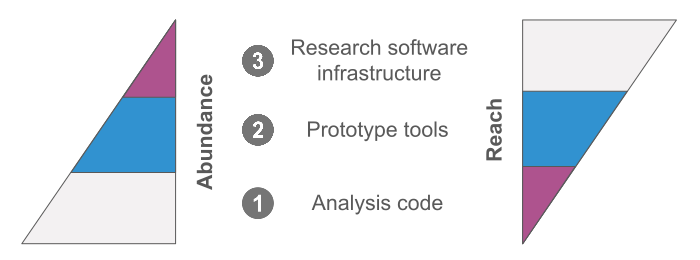

The **three-tier model of research software** provides a framework for understanding the diverse landscape of software 
in research - from scripts, code, notebooks, to computational workflows, libraries, modules, frameworks, utilities and applications. 

The three-tier model acknowledges a relationship between the tiers: software at higher tiers often comes from the further development of software at a lower tier. Software at lower tiers often rely upon software at higher tiers (e.g. established infrastructure services and libraries). This interconnectedness highlights the importance of supporting all levels of research software development and acknowledging the ways in which it can impact research and research software.
This interconnectedness highlights the importance of supporting all levels of research software development.

<!--

-->

*Diagram from ["EVERSE Paving the way towards a European Virtual Institute for Research Software Excellence" presentation](https://indico.cern.ch/event/1501988/contributions/6323204/attachments/3016679/5320601/EVERSE_Overview_Slides.pdf) by F. Psomopoulos, February 2025, adapted by Aleksandra Nenadic under CC-BY 4.0 licence*

## Analysis code

Analysis code is research software that captures computational research processes and methodology, often used in simulation, data generation, preparation, analysis and visualisation. 
It typically represents software created for personal use with a small scope, such as scripts quickly put together to analyse data.

Small analysis scripts, especially in academic research or industry projects, often remain unpublished and are only found on the personal computers of their authors.
As a consequence, results can't be easily verified or extended, scripts might be lost when a computer is wiped or a researcher leaves an institution, others may redo work that already exists but isn’t discoverable, and community growth and collaboration are hindered.

However, the trend toward publishing code alongside academic papers has been growing. 
More researchers are realising that sharing their analysis code alongside their results is essential for transparency, reproducibility, and collaboration.
When shared and collaboratively developed, analysis scripts can evolve from small, specific solutions into more comprehensive prototype or full-fledged software infrastructure tools that benefit many people in the research or software development community. 

For some examples of analysis code, see:

- [discrete-repr](https://github.com/bhigy/discrete-repr) - analysis scripts associated with the published paper ["Discrete representations in neural models of spoken language"](https://aclanthology.org/2021.blackboxnlp-1.11).
- [joint-crab](https://github.com/open-gamma-ray-astro/joint-crab) - code and related materials supporting the publication ["Towards open and reproducible multi-instrument analysis in gamma-ray astronomy"](https://www.aanda.org/articles/aa/full_html/2019/05/aa34938-18/aa34938-18.html).
- [RSE diversity analysis](https://zenodo.org/records/4662166) - Jupyter notebooks to support submission of paper ["Understanding Equity, Diversity and Inclusion Challenges Within the Research Software Community"](https://link.springer.com/chapter/10.1007/978-3-030-77980-1_30).

## Prototype tools

Prototype tools are research software that demonstrates a new idea, method or model for use beyond the project in which it originated, often as a substantive intellectual contribution or a proof of concept.
These software tools are designed to answer multiple research questions and are typically developed and used by more than one person.
They often began as a collection of analysis scripts before evolving into more comprehensive tools.

Some examples of prototype tools are provided below.

- [Nipype](https://nipype.readthedocs.io/en/latest/), a Python tool for neuroimaging data processing.
- [GROMACS](https://www.gromacs.org/), a software suite for high-performance molecular dynamics and output analysis.
- [Gemdat](https://gemdat.readthedocs.io/en/latest/) - a Python library for the analysis of diffusion in solid-state electrolytes from molecular dynamics simulations.
- [Tulipaenergymodel](https://research-software-directory.org/software/tulipaenergymodel) - an optimization model for the electricity market and its coupling with other energy sectors to determine the optimal investment and operation decisions for different types of assets.
- [CoupledNODE.jl](https://github.com/DEEPDIP-project/CoupledNODE.jl) - a Julia implementation of the Coupled Neural ODEs (CNODEs) method, a data-driven approach to solve Partial Differential Equations (PDEs) in a multiscale context using closure modelling.
- [Compas Toolkit](https://nlesc-compas.github.io/compas-toolkit/) - a high-performance C++ library offering GPU-accelerated functions for use in quantitative MRI research.
- [ehtim (ent-imaging)](https://github.com/achael/eht-imaging) - Python modules for simulating and manipulating VLBI data and producing images with regularised maximum likelihood methods for radio interferometry,
- [agnpy](https://github.com/cosimoNigro/agnpy) - a Python tool for modelling jetted Active Galactic Nuclei radiative processes.

## Research software infrastructure

Research software infrastructures include software that captures broadly accepted ideas, methods and models for use in research, warranting close researcher involvement in their development.
This tier represents a broadly applicable research software, often with a large and possibly distributed development team.

Some examples of research software infrastructures are provided below:

- [SciPy](https://scipy.org/) and [NumPy](https://numpy.org/) - provide essential numerical computing capabilities used across many scientific domains. Many of the functions and algorithms started as individual, specific analysis scripts. Over time, they were expanded, optimised, and integrated into powerful, general-purpose scientific libraries used worldwide.
- [Jupyter Notebooks/JupyterLab](https://jupyter.org/) - initially, Jupyter Notebooks were just a tool for sharing code and results in a more interactive format. But as more developers contributed, the project evolved into JupyterLab, a full-fledged web-based data science environment.
- Tools like [TensorFlow](https://www.tensorflow.org/) and [scikit-learn](https://scikit-learn.org/stable/) started out as smaller scripts and research experiments. As they gained more contributors, they evolved into comprehensive infrastructures with rich documentation, user guides, and community support.
- Open-Source projects such as [Biopython](https://biopython.org/) — what started as a set of scripts for bioinformatics has evolved into a widely-used toolkit for computational biology, with thousands of contributors.
- [Gammapy](https://github.com/gammapy/gammapy) - a Python package for gamma-ray astronomy providing a wide range of tools for analysing data from ground-based gamma-ray telescopes and space-based observatories, making it a crucial tool for astrophysicists studying cosmic sources of high-energy radiation, such as black holes, neutron stars, and supernova remnants.
The package is supported by the European Strategy Forum on Research Infrastructures (ESFRI), emphasising its importance within the European scientific community.

## Context and history

The three-tier model originated from the Australian Research Data Commons (ARDC) as part of their ["National Agenda for Research Software"](https://doi.org/10.5281/zenodo.6378082) 
and was also inspired by discussions around ["Dealing With Software Collapse"](https://ieeexplore.ieee.org/document/8701540). 
It emerged from the need to better categorise and support different types of research software, recognising that a 
one-size-fits-all approach is inadequate for the varied purposes and stakeholders involved in research software - “best practice” in the production of
analysis code, prototype tools and research software infrastructure could mean quite different things.

Since its introduction, the model has gained international recognition. 
It has been referenced in various contexts, including the ["FAIR Principles for Research Software (FAIR4RS Principles)"](https://doi.org/10.1038/s41597-022-01710-x). 
Similar tiered approaches have been adopted by other organisations, such as the German Aerospace Center (DLR) in their ["Software Engineering Guidelines"](https://doi.org/10.5281/zenodo.1344612).

The three-tier model aligns with a broader vision of recognising research software as a first-class output of research. 
It provides a framework for addressing specific challenges at each tier, from increasing transparency in analysis code 
to enabling broad impact through quality prototype tools and ensuring sustained support for research software infrastructure.

For initiatives like [EVERSE](https://everse.software/), the three-tier model offers a valuable lens through which to view research software quality 
and excellence. It suggests that practices, tools, and assessment criteria may need to be adjusted based on the tier of 
software being considered, contributing to a more comprehensive framework for research software quality that can be applied across diverse research contexts.
The essence of the three-tier model is that software in different tiers has distinct purposes, stakeholders, and needs.
This nuanced approach allows for more appropriate development, management, and assessment strategies tailored to each tier.

The three-tier of research software aligns closely with practical Software Management Plan (SMP) frameworks. 
As outlined in the ["Practical Guide to Software Management Plans"](https://doi.org/10.5281/zenodo.7248877), SMPs can be tailored to low, medium, and high 
management levels, corresponding to analysis code, prototype tools, and research software infrastructure respectively. 
This alignment demonstrates how the three-tier model can guide the development of appropriate management practices for 
different types of research software, ensuring that software management efforts are appropriately scaled to the nature 
and intended use of the software. By mapping specific SMP requirements to each tier, researchers and institutions can 
enhance the quality and sustainability of research software across all levels of complexity and scope.
