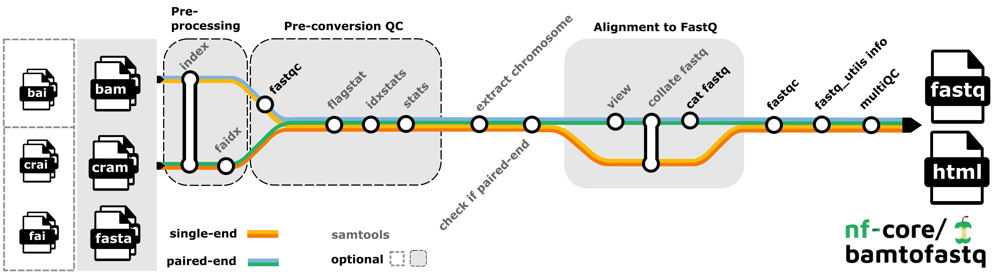

## Motivation

If you are handling large volumes of data and processing tasks where automation could boost efficiency, computational workflows are worth considering. 
They enable the integration of various research infrastructures without requiring changes to existing processes. 
Additionally, these workflows can serve as modular components that can be expanded upon as needed.

Computational workflows are structured data processing pipelines that automate complex data and compute tasks, enabling reproducibility, scalability, and transparent documentation. 
By integrating the FAIR principles into the computational workflows, both data and workflows become even more valuable, reusable assets in scientific research.
Computational workflows can mature to become more robust, moving from being a record for a specific analysis into a record of a canonical standardised workflow that is maintained on an ongoing basis.

## What are computational workflows?

Computational workflows are a special kind of software that **automate multi-step (and often multi-code and multi-tool) data analysis or data handling pipelines**, especially through the transparent and simplified use of computational resources to transform data inputs into desired outputs.

 *Bamtofastq nf-core workflow - analysis pipeline that converts (un)mapped <code>.bam</code> or <code>.cram</code> files into <code>fq.gz</code> files and performs quality control.
Obtained from: [https://nf-co.re/bamtofastq/2.2.0/](https://nf-co.re/bamtofastq/2.2.0/) under MIT licence*

Computational workflows have two prominent characteristics:

1. workflows consist of a series (or a structure) of **actions**.
These may include other workflows, software, code snippets, tools, or services.
The workflow defines the order, structure, and logic governing how these components interact to process data from inputs to final outputs.
2. workflows **abstract away** the flow of data between the components from the run mechanics, typically in some form of a high-level **workflow definition language**. 
Workflows provide a high level view of data processing pipeline and hide the full complexity of how individual actions are run - separating inputs from data flow they allow reuse. 
Workflow definitions detail inputs, dependencies, computational environment, step definitions, conditional logic, parallelism, etc. 
A dedicated **workflow management system (WMS)** is typically responsible for executing the workflow based on its definition, handling and tracking data (provenance), task scheduling and resource management.

Traditionally, researchers might link together analysis steps using **general-purpose scripting tools** (e.g., Bash scripts) or, more recently by writing ordered stages in an **electronic research notebook** (such as Jupyter, RStudio, or Apache Zeppelin) to compose computational workflows.

These approaches rely on the researcher to manually and exhaustively write a **set of instructions** to manage how inputs, outputs, and steps connect into a pipeline.
While sometimes practical, these approaches have been shown to be hard to maintain, hard to extend and hard to share.

Workflows allow users to access greater automation, reproducibility and scalability.
Unlike the traditional approaches - computational workflows focus on describing what should be done, not how it is done.

Users can also create workflows with **dedicated workflow management systems (WMS)** like , , ,  or .
These systems support high-level workflow definition languages — for example, [Nextflow Domain Specific Language (DSL)][nextflow-dsl], [Snakefile][snakefile], [Workflow Description Language (WDL)][wdl], [Common Workflow Language (CWL)][cwl], [Apache Airflow DAG][apache-airflow-dag].
These provide the generic benefits of workflows and provide documentation, tooling and communities which support their use.

In practice, researchers often combine approaches along this spectrum: for instance, a workflow might chain together simple scripts within a WMS, with the entire process launched from an electronic research notebook.

[“A Terminology for Scientific Workflow Systems” paper](https://doi.org/10.1016/j.future.2025.107974) provides an excellent overview of terminology to characterise WMSs based on workflow characteristics, composition, orchestration, data management, and metadata capture, and classifies 23 existing WMSs according to the proposed characteristics.

## Benefits of computational workflows

Using computational workflows offers several significant benefits for researchers dealing with complex or repetitive data processing and analysis tasks, including:

* **reproducibility** - workflows formalise each step of your analysis, including data inputs, tools used, parameters, and environment. This ensures that anyone (including your future self) can reproduce the same results by rerunning the workflow. Read more on other aspects of[ reproducible software environments](/reproducible_software_environments).
* **automation, efficiency and scaling** - once defined, a workflow can run automatically without manual intervention. This saves time, reduces human error, and makes it easier to repeat analyses across different datasets or experiments.
* **scalability and resource management** - WMSs can handle large-scale data and distribute tasks across HPC clusters or cloud resources efficiently — ideal for data-intensive research that would be impossible on individual machines.
* **transparency and provenance** - workflows serve as living documentation of your research process. They make your methods clear and transparent to collaborators, reviewers, and the broader community.
* **modularity and reuse** - similar to software code being built from functions and modules, workflows are built from smaller components that can be reused or swapped out. This makes your research more modular and easier to adapt to new questions or datasets.
* **collaboration and sharing** - clearly defined workflows enable easier discovery, collaboration across teams and disciplines. Everyone can understand and run the same processes, even across different systems.

## Choosing a workflow system

The choice of a workflow system often depends on the research domain (context & community), facility, and computing environment.

Different scientific communities tend to standardise around particular workflow systems that meet their needs.
For example, CERN researchers often use REANA for particle physics analyses, while ENVRI (environmental research infrastructures) tend to use workflow systems suited for environmental and earth science data, such as Nextflow or Snakemake.
Life sciences have used workflow systems for over two decades (e.g. Galaxy, Snakemake, Nextflow), see guidance on choosing systems in recent reviews ([Wratten et al. 2021](https://doi.org/10.1038/s41592-021-01254-9); [Jackson et al. 2021](https://doi.org/10.1371/journal.pcbi.1008622); [Ahmed et al. 2021](https://www.nature.com/articles/s41598-021-99288-8#citeas)).

A facility’s computing infrastructure, such as a specific cluster or cloud environment, may determine what workflow systems are supported or optimised for use, particularly important when scaling is the goal.

The availability of community-developed workflows, documentation, and user support within a domain can also strongly influence the choice.

## Discovering workflows

Researchers may wish to look for existing workflows that meet their needs, before creating one from scratch.
Reusing existing workflows helps speed up research and reduces duplication.
Users can also benefit from using tried and tested solutions — existing workflows are often peer-reviewed, widely used, or validated, which increases trust in results they produce.

Reusing computational workflows promotes reproducibility too — using community-standard workflows helps ensure people reuse the same building blocks and that analyses can be replicated and verified by others more easily.
Shared workflows make it easier to align methods across teams or projects.

Finally, users may also want to register their own workflows in a public registry or repository, making it easier for others to discover, reuse, and build upon their work.

There are several registries where researchers can find or share workflows.
Some are general-purpose, while others focus on specific domains or communities using a specific WMS or workflow definition language:

* [WorkflowHub](workflowhub.eu) – a platform supporting FAIR sharing of different workflows across disciplines, with strong uptake in life sciences
* [Galaxy ToolShed / Galaxy workflow repository](https://galaxyproject.org/toolshed/) – for discovering and sharing Galaxy-compatible tools and workflows
* [Dockstore](https://dockstore.org/) – a registry widely used in bioinformatics, supporting CWL, WDL, Nextflow, and Galaxy workflows
* [nf-core](https://nf-co.re/) – a curated collection of high-quality, community-developed Nextflow workflows (WorkflowHub also automatically registers workflows developed by nf-core)
* [REANA](https://reanahub.io/) – a platform for reusable and reproducible analysis workflows in particle physics and related fields
* [GESIS Methods Hub](https://www.gesis.org/en/services/processing-and-analyzing-data/analyzing-digital-behavioral-data/gesis-methods-hub) – a developing platform aimed at sharing workflows for social science and digital behavioural data analysis
*  /  – many researchers use these general-purpose platforms to openly share workflows alongside code, documentation, and other project materials. In GitHub search, some workflow systems are supported as a *Language* alongside traditional programming languages (e.g. [“imaging” workflows in CWL](https://github.com/search?q=imaging+language%3A%22Common+Workflow+Language%22+&type=repositories)).

## Describing workflows

How can we document and share our computational workflows for reuse?

**Workflow metadata** is descriptive information *about* a workflow — its purpose, requirements, inputs/outputs, dependencies, authorship, and provenance.
Its purpose is slightly different to that of a workflow definition language, which defines the workflow logic and tells a WMS *how* to execute it (e.g., for automation, parallelisation, and scheduling).
Workflow metadata is not for running the workflow but for understanding, managing and discovering it.

[Workflow RO-Crate](https://about.workflowhub.eu/Workflow-RO-Crate/) is the metadata standard used by [WorkflowHub registry][workflowhub] and [LifeMonitor service][lifemonitor] for publishing computational workflows, enabling researchers to share, discover, and reuse workflows with rich, structured descriptions that support reproducibility and the FAIR principles.
It is a lightweight, structured metadata format designed to package and describe computational workflows and their associated resources in a FAIR-compliant way, extending the more general [schemas.science ComputationalWorkflow Profile](https://schemas.science/profiles/ComputationalWorkflow/) (stemming from [Bioschemas](https://bioschemas.org/)).
It builds on the [RO-Crate][ro-crate] metadata standard to encapsulate not only the workflow definition (e.g. CWL, Nextflow DSL, Snakefile) but also key contextual information such as inputs/outputs (via [schemas.science FormalParameter](https://schemas.science/profiles/FormalParameter/), software dependencies, authorship, and execution environment.
By using Workflow RO-Crate, researchers can make their workflows more discoverable, portable, and reproducible—enabling others to understand, reuse, and re-run analyses with greater ease and confidence.
It simplifies workflow sharing, supports interoperability, and is especially useful for publishing workflows alongside datasets or in workflow registries.

## Integration with the FAIR principles

As digital objects to be shared, discovered, and reused, computational workflows benefit from adhering to[ the FAIR principles](/fair_rs) in general and specifically the[ FAIR recommendations for workflows](https://doi.org/10.1038/s41597-025-04451-9).
It can maximise their quality and value as research assets and facilitate their adoption by the wider community, which is essential for[ modern research data management](https://rdmkit.elixir-europe.org/).

The[ Workflows Community Initiative’s FAIR Workflows Working Group (WCI-FW)](https://workflows.community/groups/fair/), a global and open community of researchers and developers working with computational workflows across disciplines and domains, has systematically addressed the application of both FAIR data and software principles to computational workflows.

[apache-airflow-dag]: https://airflow.apache.org/docs/apache-airflow/stable/core-concepts/dags.html
[cwl]: https://www.commonwl.org/
[wdl]: https://openwdl.org/
[snakefile]: https://snakemake.readthedocs.io/en/stable/snakefiles/writing_snakefiles.html
[nextflow-dsl]: https://www.nextflow.io/docs/latest/reference/syntax.html
[rdmkit]: https://rdmkit.elixir-europe.org/
[WCI-FW]: https://workflows.community/groups/fair/
[fair-workflows]: https://doi.org/10.1038/s41597-025-04451-9
[wf-ro-crate]: https://about.workflowhub.eu/Workflow-RO-Crate/
[ro-crate]: https://www.researchobject.org/ro-crate/
[bioschemas-wf-profile]: https://bioschemas.org/profiles/ComputationalWorkflow/1.0-RELEASE
[bioschemas-formal-parameter]: https://bioschemas.org/types/FormalParameter/1.0-RELEASE
[reana]: https://reanahub.io/
[galaxy-toolshed]: https://galaxyproject.org/toolshed/
[dockstore]: https://dockstore.org/
[nf-core]: https://nf-co.re/
[gesis-methods-hub]: https://www.gesis.org/en/services/processing-and-analyzing-data/analyzing-digital-behavioral-data/gesis-methods-hub
[wms-terminology]: https://arxiv.org/abs/2506.07838
[workflowhub]: https://workflowhub.eu
[lifemonitor]: https://app.lifemonitor.eu/dashboard
