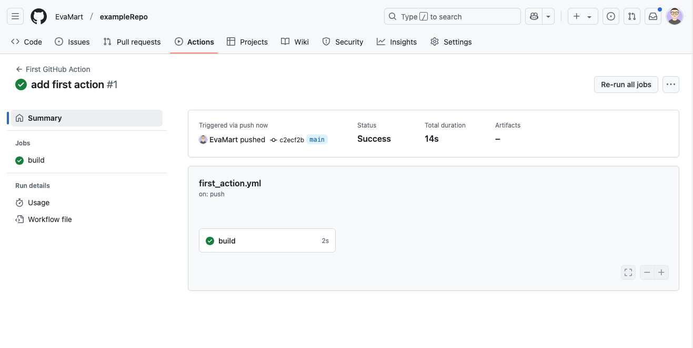
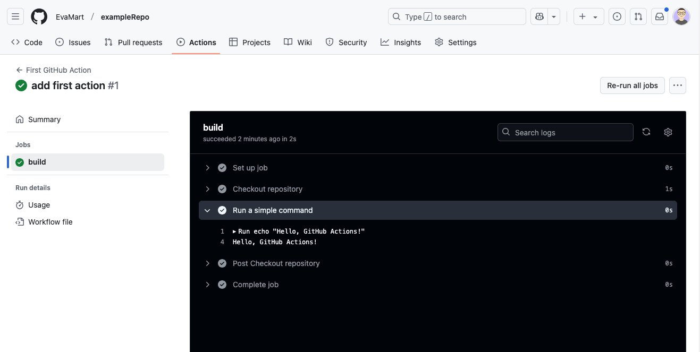

## Task automation using GitHub Actions

### Description

 is a powerful [automation tool](https://docs.github.com/en/actions/about-github-actions/understanding-github-actions) ([continuous integration (CI)](https://docs.github.com/en/actions/about-github-actions/about-continuous-integration-with-github-actions) and [continuous delivery (CD)](https://docs.github.com/en/actions/about-github-actions/about-continuous-deployment-with-github-actions) platform) that allows you to define workflows (called `actions`) for your repository that help automate tasks such as building, testing and deploying code.
GitHub Actions enable you to streamline development processes and improve efficiency.

### Considerations

* Ensure your repository has a `.github/workflows/` directory where workflow files will be stored.
* Workflows are defined using YAML files (`.yml` or `.yaml`).
* Actions can be triggered by various GitHub events, such as `push`, `pull_request`, or scheduled times.
* GitHub provides a marketplace with reusable actions that can be integrated into workflows.
* Understanding basic YAML syntax is essential for configuring GitHub Actions correctly.
* The workflow execution environment supports different operating systems, including Ubuntu, Windows, and macOS.
* Review the repository's security settings to control access to sensitive information, such as API keys and credentials, stored as secrets.

### Solutions

### Creating a basic GitHub Action workflow  

Setting up a GitHub Action workflow allows you to automate tasks like testing and deployment.
By defining a workflow file, you can specify triggers and actions to execute when specific events occur.

To create a basic workflow follow these steps:

* Navigate to your GitHub repository and create a `.github/workflows/ directory` if it doesn't exist.
* Create a new YAML file (e.g., `first-action.yml`) inside this directory.
* Define a basic workflow that runs on `push` events:

  ```yaml
    name: First GitHub Action
    on: [push]
    jobs:
      build:
        runs-on: ubuntu-latest
        steps:
          - name: Checkout repository
            uses: actions/checkout@v4
          - name: Run a simple command
            run: echo "Hello, GitHub Actions!"
    ``` 

* Commit and push this file to your repository.
* Go to the **Actions** tab in your GitHub repository to see the workflow run. 
The **real-time visualisation graph** displayed here provides a clear sequence of executed jobs, making it easier to track progress and identify potential issues. 
Click on individual jobs to expand the steps, where you'll find **detailed logs and error messages** to help with troubleshooting and debugging efficiently.  





#### Using pre-built actions from the GitHub Marketplace 

The [GitHub Marketplace](https://github.com/marketplace?type=actions) provides pre-built actions that can be easily integrated into workflows to automate tasks.
To use an action from the Marketplace, follow these steps:

* Search for a relevant action in the Marketplace and open its page.
* Copy the code provided under the **"Use latest version"** section and add it to your workflow file.
* For example, you could decide to use the [pre-built Python setup action](https://github.com/marketplace/actions/setup-python) to ensure the correct Python version is available for running scripts, tests, or installations. 
Copy the following `step` into your workflow file:

  ```yaml
  - name: Setup Python
    uses: actions/setup-python@v4
    with:
      python-version: '3.10'
  ```

#### Automating testing with GitHub Actions 

* Use actions to run tests automatically after each push. 
* Example: Running unit tests for a Python project using `pytest`:

  ```yaml
  jobs:
    test:
      runs-on: ubuntu-latest
      steps:
        - name: Checkout repository
          uses: actions/checkout@v4
        - name: Setup Python
          uses: actions/setup-python@v4
          with:
            python-version: '3.10'
        - name: Install dependencies
          run: |
            python -m pip install --upgrade pip
            pip install -r requirements.txt
        - name: Run tests
          run: pytest
  ```


## Further guidance

### General documentation

* [GitHub Actions documentation](https://docs.github.com/en/actions) - Official documentation covering all aspects of GitHub Actions.
* [GitHub marketplace for actions](https://github.com/marketplace/actions) - Browse and search for actions to use in your workflows.
* [GitHub actions examples](https://github.com/actions) - Collection of sample workflows and configurations.
* [YAML syntax guide](https://yaml.org/) - Learn YAML syntax for writing workflow files.

### Specific tools used in the examples 

* [setup-python Action](https://github.com/actions/setup-python) - Official action for setting up Python in GitHub Actions workflows.
* [pytest Documentation](https://docs.pytest.org/en/stable/) - Comprehensive guide for writing and running Python tests with pytest.  

### Security considerations

* [Using Secrets in GitHub Actions](https://docs.github.com/en/actions/security-for-github-actions/security-guides/using-secrets-in-github-actions) - Guide on securely managing sensitive information in GitHub Actions workflows.

### Other training materials

* [Carpentries Intermediate Research Software Development guide (Python)](https://carpentries-incubator.github.io/python-intermediate-development/23-continuous-integration-automated-testing.html) (episode on continuous integration for automated testing)
* [Software Carpentry course for Managing Research Software Projects](https://swcarpentry.github.io/managing-research-software-projects/14-continuous/)
* [The Turing Way's Guide for Reproducible Research](https://book.the-turing-way.org/reproducible-research/ci/ci-github-actions) (chapter on Continuous Integration with GitHub Actions)
* [Python 201](https://python-tutorial.dev/201/tutorial/testing.html#ci-cd) (CI / CD) chapter

## References 

The official [GitHub Actions documentation](https://docs.github.com/en/actions) was consulted for accuracy and best practices.