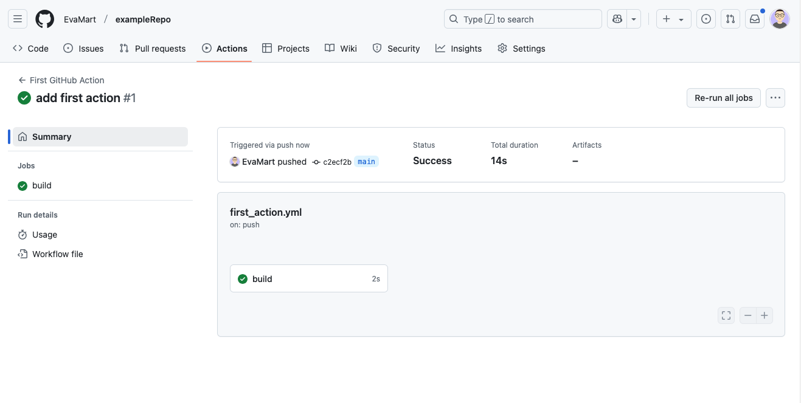

<!-- Please take in mind our style guide https://rdmkit.elixir-europe.org/style_guide when writing the content of this page. -->

## How to add an action to my GitHub repository?
 
### Description

Short explanation of what this problem is about.

GitHub Actions is a powerful automation tool that allows you to define workflows for your repository. It helps automate tasks such as testing, building, and deploying code. Setting up your first GitHub Action enables you to streamline development processes and improve efficiency.

### Considerations

* Ensure your repository has a `.github/workflows/` directory where workflow files will be stored.
* Workflows are defined using YAML files (`.yml` or `.yaml`).
* Actions can be triggered by various GitHub events, such as `push`, `pull_request`, or scheduled times.
* GitHub provides a marketplace with reusable actions that can be integrated into workflows.
* Understanding basic YAML syntax is essential for configuring GitHub Actions correctly.
* The workflow execution environment supports different operating systems, including Ubuntu, Windows, and macOS.
* Review the repository's security settings to control access to sensitive information, such as API keys and credentials, stored as secrets.


### Solutions

* **Creating a basic GitHub Action workflow**  

  Setting up a GitHub Action workflow allows you to automate tasks like testing and deployment. By defining a workflow file, you can specify triggers and actions to execute when specific events occur. 

  To create a basic workflow follow these steps:

  * Navigate to your GitHub repository and create a `.github/workflows/ directory` if it doesn't exist.
  * Create a new YAML file (e.g., `first-action.yml`) inside this directory.
  * Define a basic workflow that runs on `push` events:
    ```yaml
    name: First GitHub Action
    on: [push]
    jobs:
      build:
        runs-on: ubuntu-latest
        steps:
          - name: Checkout repository
            uses: actions/checkout@v4
          - name: Run a simple command
            run: echo "Hello, GitHub Actions!"
    ``` 

  * Commit and push this file to your repository.
  * Go to the **Actions** tab in your GitHub repository to see the workflow run. The **real-time visualization graph** displayed here provides a clear sequence of executed jobs, making it easier to track progress and identify potential issues. Click on individual jobs to expand the steps, where you'll find **detailed logs and error messages** to help with troubleshooting and debugging efficiently.  


     

    

* **Using pre-built actions from the GitHub Marketplace** 

  The [GitHub Marketplace](https://github.com/marketplace?type=actions) provides pre-built actions that can be easily integrated into workflows to automate tasks. To use an action from the Marketplace, follow these steps:  

  * Search for a relevant action in the Marketplace and open its page. 

  * Copy the code provided under the **"Use latest version"** section and add it to your workflow file.   

  * For example, you could decide to use the [pre-built Python setup action](https://github.com/marketplace/actions/setup-python) to ensure the correct Python version is available for running scripts, tests, or installations. Copy the following `step` into your workflow file:
    ```yaml
    - name: Setup Python
      uses: actions/setup-python@v4
      with:
        python-version: '3.10'
    ```

* **Automating testing with GitHub Actions** 

  * Use actions to run tests automatically after each push. 

  * Example: Running unit tests for a Python project using pytest:
      ```yaml
      jobs:
        test:
          runs-on: ubuntu-latest
          steps:
            - name: Checkout repository
              uses: actions/checkout@v4
            - name: Setup Python
              uses: actions/setup-python@v4
              with:
                python-version: '3.10'
            - name: Install dependencies
              run: |
                python -m pip install --upgrade pip
                pip install -r requirements.txt
            - name: Run tests
              run: pytest
      ```
    

## How to cite this page 
  <!--contributors, page URL. Last date of access.--> 
 Eva Martín del Pico, [](). [Last date of access]. 

## Tools and resources 

* **General documentation:**

  * [GitHub Actions Documentation](https://docs.github.com/en/actions) - Official documentation covering all aspects of GitHub Actions.
  * [GitHub Marketplace for Actions](https://github.com/marketplace/actions) - Browse and search for actions to use in your workflows.
  * [GitHub Actions Examples](https://github.com/actions) - Collection of sample workflows and configurations.
  * [YAML Syntax Guide](https://yaml.org/) - Learn YAML syntax for writing workflow files.

* **Specific tools used in the examples:** 

  * [setup-python Action](https://github.com/actions/setup-python) - Official action for setting up Python in GitHub Actions workflows.
  * [pytest Documentation](https://docs.pytest.org/en/stable/) - Comprehensive guide for writing and running Python tests with pytest.  

* **Security Considerations:**

  * [Using Secrets in GitHub Actions](https://docs.github.com/en/actions/security-for-github-actions/security-guides/using-secrets-in-github-actions) - Guide on securely managing sensitive information in GitHub Actions workflows.

## References <!-- do not delete this heading and write your text below it -->
The official [GitHub Actions documentation](https://docs.github.com/en/actions) was consulted for accuracy and best practices.
 
