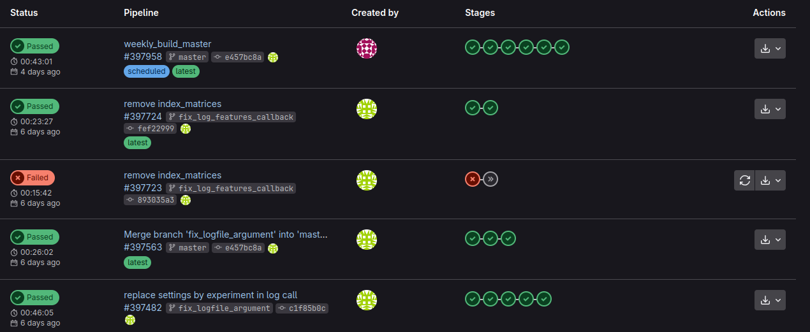

## What is Gitlab CI?

### Description

Gitlab CI is the tool used in Gitlab hosted projects (gitlab.com and self hosted Gitlab instances) to run CI/CD pipelines. It is the equivalent of Github Actions on github.com hosted repositories.
If you are interested in migrating a Github actions into Gitlab CI, you can follow [gitlab.com dedicated article on Github Actions migration](https://docs.gitlab.com/ci/migration/github_actions/)

Motivations to setup a Gitlab CI pipeline:

- running unit tests
- build your application
- build a docker container
- deploy documentation
- deploy and generate package
- check dependencies
- ...

### Considerations

To create and run your first pipeline:

- ensure you have runners available to run your jobs. If you are using gitlab.com, you can skip this step as gilab.com provides instance runners for you.
- create a `.gitlab-ci.yml` file at the root of your repository. This file, written with YAML syntax, defines the pipelines and jobs you want to run.
- commit and push this file to your repository.
- Go to the **Pipelines** tab in yout Gitlab repository to see the pipeline run. This dashboard provide you the list of the pipelines run for your project, with the workflow of the different stages. You can access the different jobs by clicking on the **Stages** elements to have more information about their respective status.




**Using pre-builts components from the Gitlab CI/CD Catalog**
The [Gitlab CI/CD Catalog](https://gitlab.com/explore/catalog) provides a list of components to use in your own pipeline.
Most of these provides a README describing how you can use them and how to configure them for your own purpose.


### Solutions

You can follow Gitlab first tutorial [^gitlabci_first_tuto] and the more advanced one [^gitlabci_advanced_tuto]. Gitlab.com is also providing some typical examples based on your programmation language and type of project [^gitlabci_examples].

Example of `.gitlab-ci.yml`

```yml
stages:
    - build
    - deploy

build-job-name1:
    stage: build
    script:
        - echo "Starting job 1"

build-job-name2:
    stage: build
    script:
        - echo "Starting job 2"

deploy-job-name:
    stage: deploy
    script:
        - echo "Deploy"
```

This will create a pipeline with two stages `build` and `deploy`. The stage `build` is composed of two independant jobs that will be run in parallel if you have enough runners. The `deploy` stage will be run after `build` stage is finished. This is defined by the `stages:` list. By default, if a job fails, the other jobs in that stage are run but not the one in the following stages.

In the next part of the example, a new job, named ̀`build-job-name1`, is defined. The mandatory fields are : `stage`and `script`. The first one is used to associate this job to a stage defined in the `stages`key. `script` is defining the script to be run by this job. It can be composed by multiple commands separated as a list.

The rest of the file defines two other jobs `build-job-name2` and `deploy-job-name2`. The stage named `build` has 2 jobs that are run in paralell. If you need the output of one job to run another one, you should put them in separate stages. In our example case, the job `deploy_job-name` could use artefacts generated by jobs in the stage 

*note:* the example of gitlab-ci above is a dummy example that just present the structure of the gitlab-ci.yml file. In practice, it only print somes messages to simulate scripts.


## Realcase example


## Tools and resources

- [Gitlab CI documentations](https://docs.gitlab.com/ee/ci/) - Official Gitlab CI documentation.
- [Gitlab CI examples](https://docs.gitlab.com/ee/ci/examples/) - List of commonly used `.gitlab-ci.yml` files.
- [Gitlab CI Syntax](https://docs.gitlab.com/ee/ci/yaml/) - Get familiar with all the protected keywords and syntax used in Gitlab CI.
- [YAML syntax guide](https://yaml.org/) - Learn YAML syntax for writing workflow files.

## References

[^gitlabci_first_tuto]: [https://docs.gitlab.com/ee/ci/quick_start/](https://docs.gitlab.com/ee/ci/quick_start/)

[^gitlabci_advanced_tuto]: [https://docs.gitlab.com/ee/ci/quick_start/tutorial.html](https://docs.gitlab.com/ee/ci/quick_start/tutorial.html)

[^gitlabci_examples]: [https://docs.gitlab.com/ee/ci/examples/](https://docs.gitlab.com/ee/ci/examples/)

[^gitlabci_syntax]: [https://docs.gitlab.com/ee/ci/yaml/](https://docs.gitlab.com/ee/ci/yaml/)

[^gitlabci-antipatterns]: [https://dev.to/zenika/gitlab-ci-10-best-practices-to-avoid-widespread-anti-patterns-2mb5](https://dev.to/zenika/gitlab-ci-10-best-practices-to-avoid-widespread-anti-patterns-2mb5)

