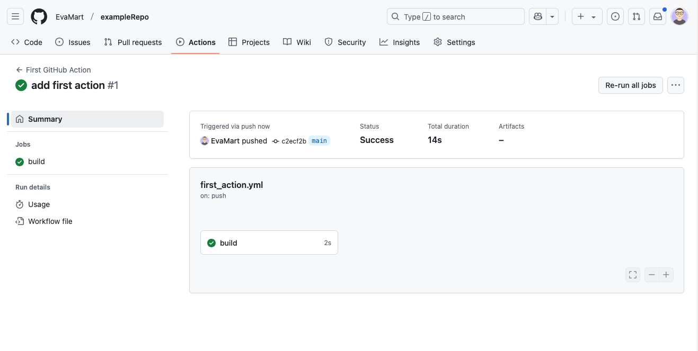
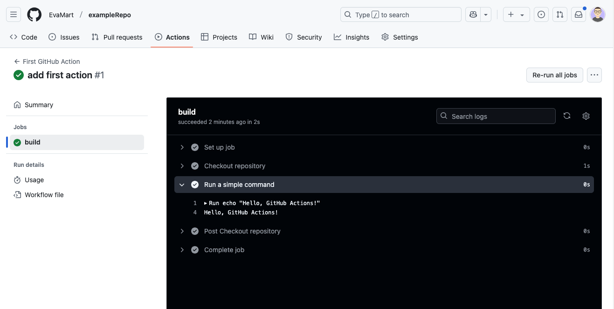

## Task automation using GitHub Actions

### Description

 is a powerful [automation tool](https://docs.github.com/en/actions/about-github-actions/understanding-github-actions) ([continuous integration (CI)](https://docs.github.com/en/actions/about-github-actions/about-continuous-integration-with-github-actions) and [continuous delivery (CD)](https://docs.github.com/en/actions/about-github-actions/about-continuous-deployment-with-github-actions) platform) that allows you to define workflows (called `actions`) for your repository that help automate tasks such as building, testing and deploying code. GitHub Actions enable you to streamline development processes and improve efficiency.

### Considerations

* Ensure your repository has a `.github/workflows/` directory where workflow files will be stored.
* Workflows are defined using YAML files (`.yml` or `.yaml`).
* Actions can be triggered by various GitHub events, such as `push`, `pull_request`, or scheduled times.
* GitHub provides a marketplace with reusable actions that can be integrated into workflows.
* Understanding basic YAML syntax is essential for configuring GitHub Actions correctly.
* The workflow execution environment supports different operating systems, including Ubuntu, Windows, and macOS.
* Review the repository's security settings to control access to sensitive information, such as API keys and credentials, stored as secrets.

### Solutions

* **Creating a basic GitHub Action workflow**  

  Setting up a GitHub Action workflow allows you to automate tasks like testing and deployment. By defining a workflow file, you can specify triggers and actions to execute when specific events occur.

  To create a basic workflow follow these steps:

  * Navigate to your GitHub repository and create a `.github/workflows/ directory` if it doesn't exist.
  * Create a new YAML file (e.g., `first-action.yml`) inside this directory.
  * Define a basic workflow that runs on `push` events:
    ```yaml
    name: First GitHub Action
    on: [push]
    jobs:
      build:
        runs-on: ubuntu-latest
        steps:
          - name: Checkout repository
            uses: actions/checkout@v4
          - name: Run a simple command
            run: echo "Hello, GitHub Actions!"
    ``` 

  * Commit and push this file to your repository.
  * Go to the **Actions** tab in your GitHub repository to see the workflow run. The **real-time visualisation graph** displayed here provides a clear sequence of executed jobs, making it easier to track progress and identify potential issues. Click on individual jobs to expand the steps, where you'll find **detailed logs and error messages** to help with troubleshooting and debugging efficiently.  


    

    

* **Using pre-built actions from the GitHub Marketplace** 

  The [GitHub Marketplace](https://github.com/marketplace?type=actions) provides pre-built actions that can be easily integrated into workflows to automate tasks. To use an action from the Marketplace, follow these steps:

  * Search for a relevant action in the Marketplace and open its page. 

  * Copy the code provided under the **"Use latest version"** section and add it to your workflow file.   

  * For example, you could decide to use the [pre-built Python setup action](https://github.com/marketplace/actions/setup-python) to ensure the correct Python version is available for running scripts, tests, or installations. Copy the following `step` into your workflow file:

    ```yaml
    - name: Setup Python
      uses: actions/setup-python@v4
      with:
        python-version: '3.10'
    ```

* **Automating testing with GitHub Actions** 

  * Use actions to run tests automatically after each push. 

  * Example: Running unit tests for a Python project using pytest:
      ```yaml
      jobs:
        test:
          runs-on: ubuntu-latest
          steps:
            - name: Checkout repository
              uses: actions/checkout@v4
            - name: Setup Python
              uses: actions/setup-python@v4
              with:
                python-version: '3.10'
            - name: Install dependencies
              run: |
                python -m pip install --upgrade pip
                pip install -r requirements.txt
            - name: Run tests
              run: pytest
      ```


## Further guidance

* **General documentation:**

  * [GitHub Actions documentation](https://docs.github.com/en/actions) - Official documentation covering all aspects of GitHub Actions.
  * [GitHub marketplace for actions](https://github.com/marketplace/actions) - Browse and search for actions to use in your workflows.
  * [GitHub actions examples](https://github.com/actions) - Collection of sample workflows and configurations.
  * [YAML syntax guide](https://yaml.org/) - Learn YAML syntax for writing workflow files.

* **Specific tools used in the examples:** 

  * [setup-python Action](https://github.com/actions/setup-python) - Official action for setting up Python in GitHub Actions workflows.
  * [pytest Documentation](https://docs.pytest.org/en/stable/) - Comprehensive guide for writing and running Python tests with pytest.  

* **Security Considerations:**

  * [Using Secrets in GitHub Actions](https://docs.github.com/en/actions/security-for-github-actions/security-guides/using-secrets-in-github-actions) - Guide on securely managing sensitive information in GitHub Actions workflows.

* **Other training materials:**
  * [Carpentries Intermediate Research Software Development guide (Python)](https://carpentries-incubator.github.io/python-intermediate-development/23-continuous-integration-automated-testing.html) (episode on continous integration for automated testing)
  * [Software Carpentry course for Managing Research Software Projects](https://swcarpentry.github.io/managing-research-software-projects/14-continuous/)
  * [The Turing Way's Guide for Reproducible Research](https://book.the-turing-way.org/reproducible-research/ci/ci-github-actions) (chapter on Continuous Integration with GitHub Actions)
  * [Python 201](https://python-tutorial.dev/201/tutorial/testing.html#ci-cd) (CI / CD) chapter

## References <!-- do not delete this heading and write your text below it --> The official [GitHub Actions documentation](https://docs.github.com/en/actions) was consulted for accuracy and best practices.
