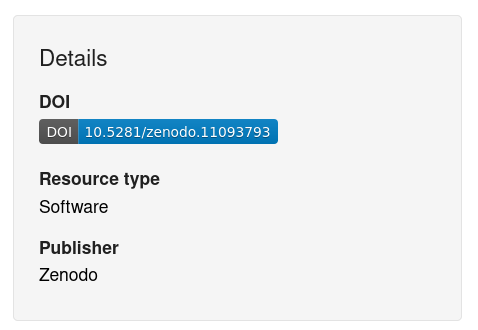
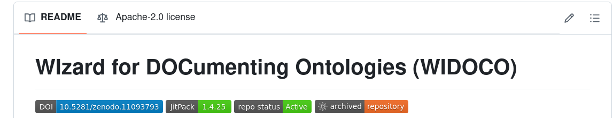

## How can I get a Digital Object Identifier (DOI) for my code release?

### Description 
Obtaining a DOI (a type of persistent identifier) for your software has become [increasingly popular][datacite-doi-software] to indicate others how to cite your software (either in a publication or as an independent way of referring to your software versions). In this document we describe how to obtain a DOI to refer to your software releases.

### Considerations 
* You use [GitHub][github] as your software repository
* You make software releases (e.g. using [semantic versioning][semantic-versioning])
* You would like a DOI for your software releases
* You use or are happy to make an account on the [Zenodo][zenodo] archive 

### Solutions 

* Link your GitHub repository to Zenodo
	* Go to Zenodo.
	* If you don’t have an account, make an account.
	* Navigate to your [Zenodo my account page](https://zenodo.org/account/settings/profile)
	* Click on the GitHub option, Click on Connect
	* Authorise Zenodo to access your GitHub account
	* Choose which repository you would like to create a DOI for under the repositories sections
		* You may need to scroll down to find the repository if you have access to many repositories

* [Create a GitHub release](https://everse.software/RSQKit/releasing_code) for the repository you have enabled. 
	* Go to your repository
	* Click on releases and then on Draft a new release
	* Remember to use a version number (semantic versioning is the common standard but there are other schemes such as [CalVer][calver] which is date based)-->
	
* Zenodo will automatically archive this release:
	* Once your GitHub repository is linked to Zenodo, any new release you publish on GitHub will be archived by Zenodo
	* Zenodo will automatically issue a DOI for your release

* Get the DOI:
	* After the GitHub release, go to Zenodo, where you will see your repository archived with a DOI assigned to it. Your badge is available in "Details":

* Copy the badge in your README file:
	* Now you can add the Zenodo badge in your GitHub repository. Click on the blue DOI and copy the markdown in your README. It will show as follows:

## Tools and resources 

* Tools: [GitHub][github], [Zenodo][zenodo], [your Zenodo account GitHub integrations settings][your-zenodo-github]
* Documentation: [On GitHub][on-github], [GitHub Integration FAQ entries on Zenodo][github-faq-zenodo] 

## References

* [Making code citable with Zenodo and GitHub][citable-github-ssi]
* [What are persistent identifiers (PIDs)?][what-are-pids]

[calver]: (https://calver.org/)
[citable-github-ssi]: (https://www.software.ac.uk/blog/making-code-citable-zenodo-and-github)
[datacite-doi-software]: (https://datacite.org/blog/doi-registrations-software/)
[doi]: (https://www.doi.org/)
[github]: (https://github.com/)
[github-faq-zenodo]: (https://support.zenodo.org/help/en-gb/24-github-integration)
[on-github]: (https://docs.github.com/en/repositories/archiving-a-github-repository/referencing-and-citing-content)
[semantic-versioning]: (https://semver.org/) 
[what-are-pids]: (https://support.orcid.org/hc/en-us/articles/360006971013-What-are-persistent-identifiers-PIDs)
[zenodo]: (https://zenodo.org/)
[your-zenodo-github]: (https://zenodo.org/account/settings/github/)

